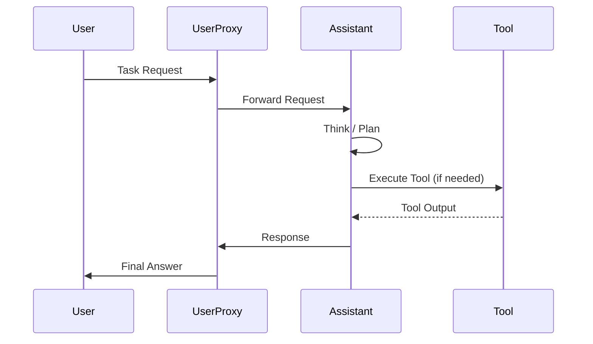
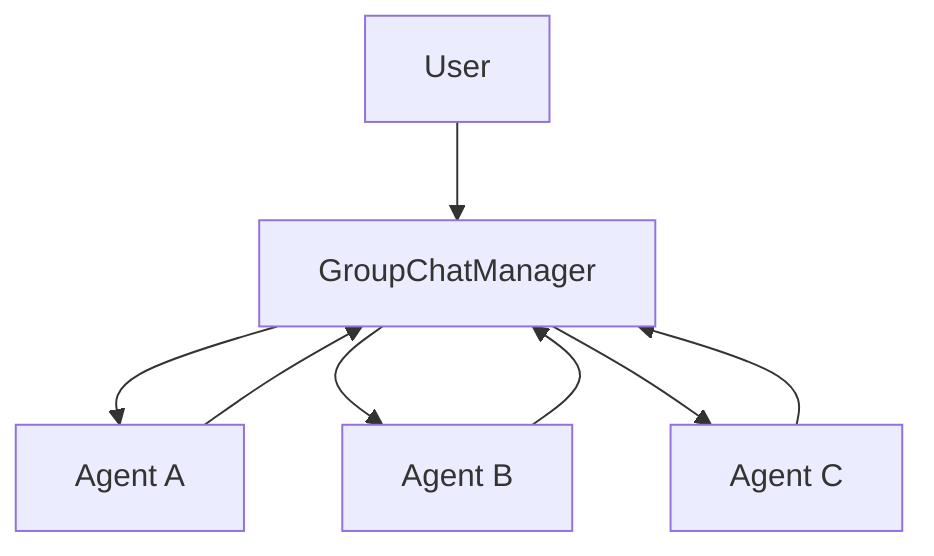
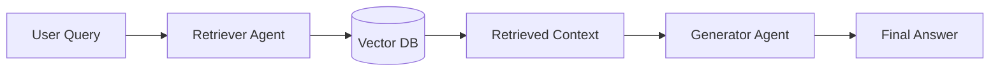

# AG2 (AutoGen) Architecture Diagrams

**Version:** 0.3.2
**Last Updated:** November 2025
**Focus:** Visualizing AG2 Systems

## Overview

This document provides visual representations of AG2 architectures and workflows.

## Agent Interaction Flow

## Group Chat Architecture

## RAG (Retrieval-Augmented Generation) Flow

