# LangGraph: Visual Architectures & Diagrams

## Basic State Machine

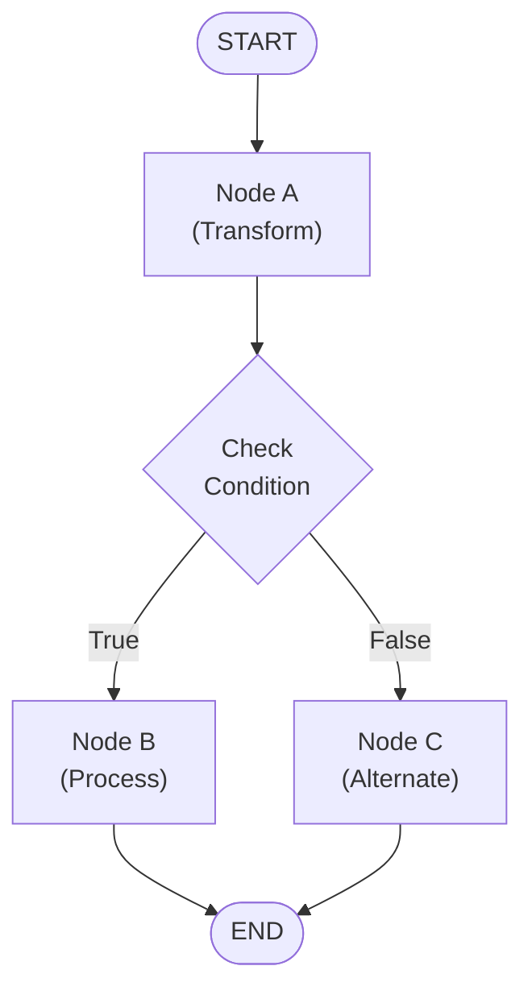
```mermaid
graph TD
    START([START]) --> Node_A["Node A<br/>(Transform)"]
    Node_A --> Condition{"Check<br/>Condition"}
    Condition -->|True| Node_B["Node B<br/>(Process)"]
    Condition -->|False| Node_C["Node C<br/>(Alternate)"]
    Node_B --> END([END])
    Node_C --> END
```

## Simple Chat Agent with Persistence

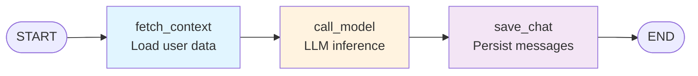
```mermaid
graph LR
    START([START]) --> Fetch["fetch_context<br/>Load user data"]
    Fetch --> Model["call_model<br/>LLM inference"]
    Model --> Save["save_chat<br/>Persist messages"]
    Save --> END([END])
    
    style Fetch fill:#e1f5ff
    style Model fill:#fff3e0
    style Save fill:#f3e5f5
```

## Supervisor Multi-Agent Pattern

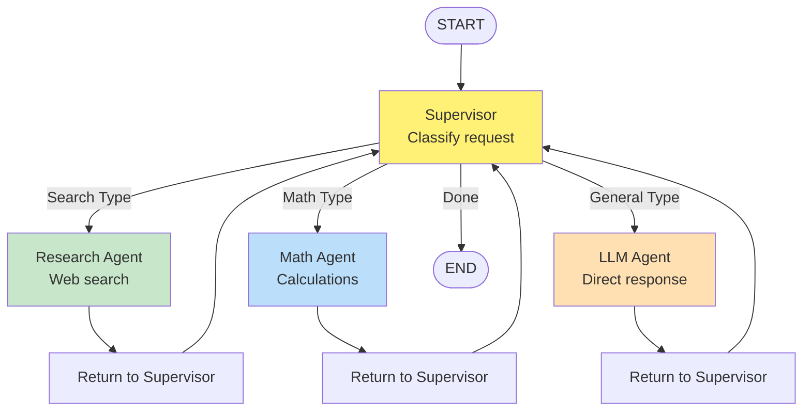
```mermaid
graph TD
    START([START]) --> Supervisor["Supervisor<br/>Classify request"]
    
    Supervisor -->|Search Type| Research["Research Agent<br/>Web search"]
    Supervisor -->|Math Type| Math["Math Agent<br/>Calculations"]
    Supervisor -->|General Type| LLM["LLM Agent<br/>Direct response"]
    
    Research --> Return1["Return to Supervisor"]
    Math --> Return2["Return to Supervisor"]
    LLM --> Return3["Return to Supervisor"]
    
    Return1 --> Supervisor
    Return2 --> Supervisor
    Return3 --> Supervisor
    
    Supervisor -->|Done| END([END])
    
    style Supervisor fill:#fff176
    style Research fill:#c8e6c9
    style Math fill:#bbdefb
    style LLM fill:#ffe0b2
```

## Parallel Worker Pattern (Fan-out/Fan-in)

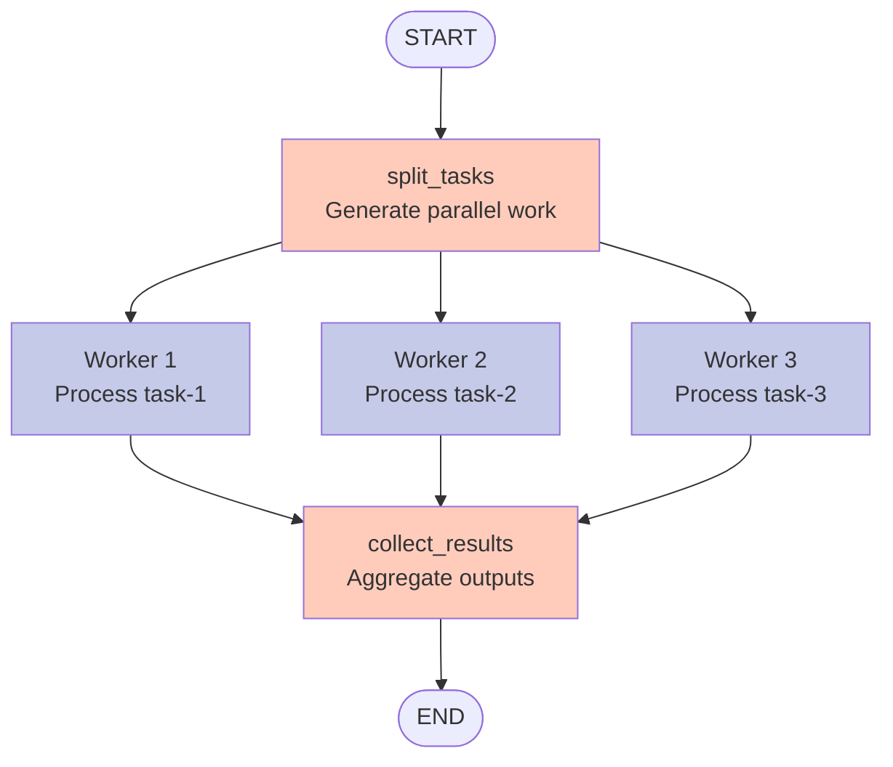
```mermaid
graph TD
    START([START]) --> Split["split_tasks<br/>Generate parallel work"]
    
    Split --> Worker1["Worker 1<br/>Process task-1"]
    Split --> Worker2["Worker 2<br/>Process task-2"]
    Split --> Worker3["Worker 3<br/>Process task-3"]
    
    Worker1 --> Collect["collect_results<br/>Aggregate outputs"]
    Worker2 --> Collect
    Worker3 --> Collect
    
    Collect --> END([END])
    
    style Split fill:#ffccbc
    style Worker1 fill:#c5cae9
    style Worker2 fill:#c5cae9
    style Worker3 fill:#c5cae9
    style Collect fill:#ffccbc
```

## Tool-Using ReAct Loop

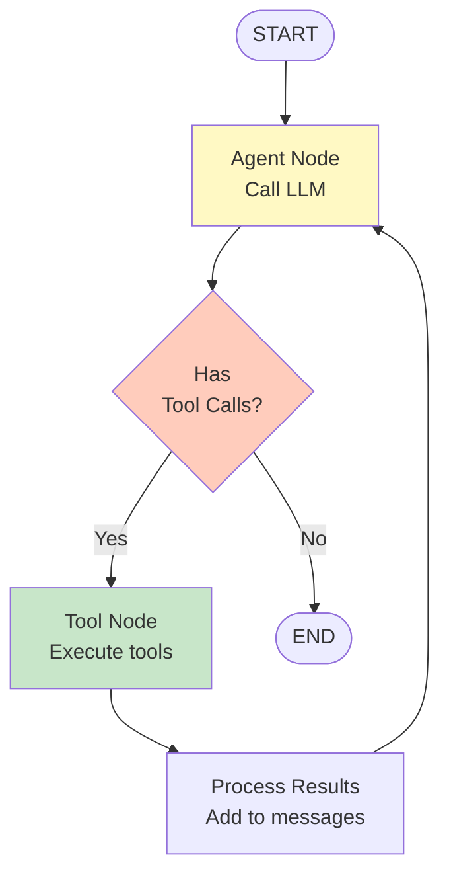
```mermaid
graph TD
    START([START]) --> Agent["Agent Node<br/>Call LLM"]
    
    Agent --> HasTools{"Has<br/>Tool Calls?"}
    
    HasTools -->|Yes| Tools["Tool Node<br/>Execute tools"]
    HasTools -->|No| END([END])
    
    Tools --> Process["Process Results<br/>Add to messages"]
    Process --> Agent
    
    style Agent fill:#fff9c4
    style Tools fill:#c8e6c9
    style HasTools fill:#ffccbc
```

## Conditional Routing with Multiple Paths

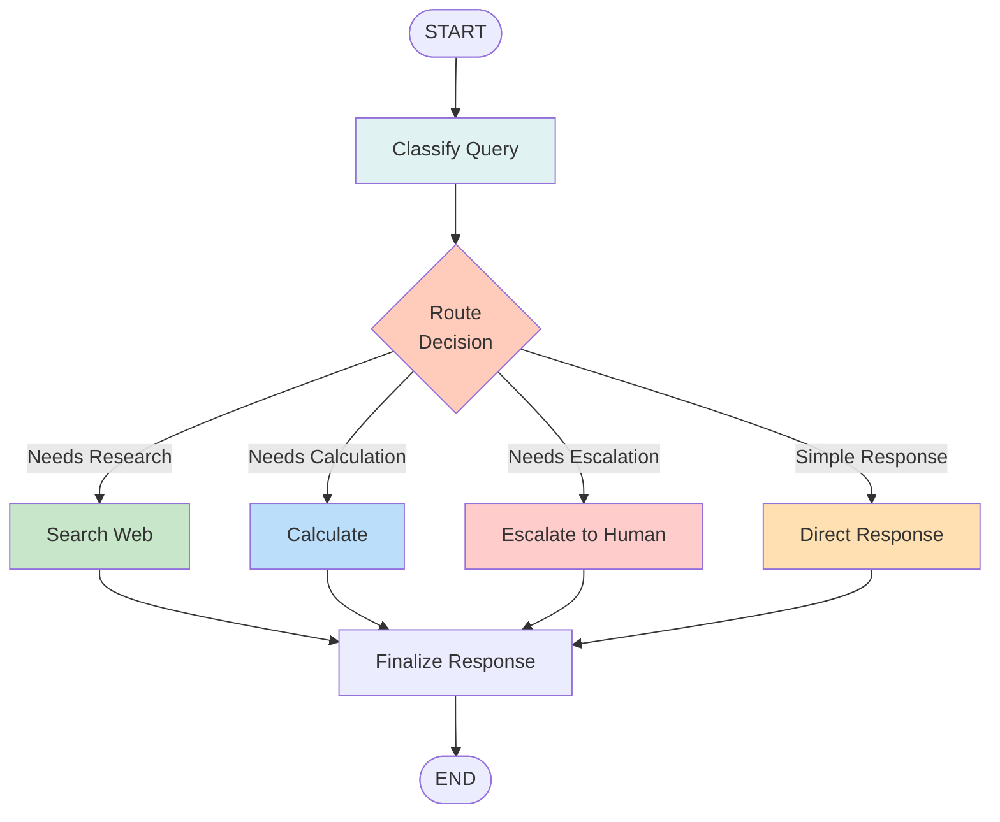
```mermaid
graph TD
    START([START]) --> Classify["Classify Query"]
    
    Classify --> Route{"Route<br/>Decision"}
    
    Route -->|Needs Research| Search["Search Web"]
    Route -->|Needs Calculation| Calc["Calculate"]
    Route -->|Needs Escalation| Escalate["Escalate to Human"]
    Route -->|Simple Response| Direct["Direct Response"]
    
    Search --> Finalize["Finalize Response"]
    Calc --> Finalize
    Escalate --> Finalize
    Direct --> Finalize
    
    Finalize --> END([END])
    
    style Classify fill:#e0f2f1
    style Route fill:#ffccbc
    style Search fill:#c8e6c9
    style Calc fill:#bbdefb
    style Escalate fill:#ffcccc
    style Direct fill:#ffe0b2
```

## Loop Pattern with Counter Safeguard

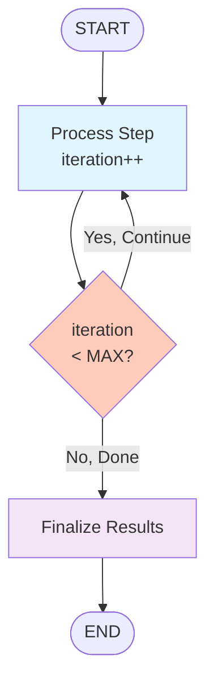
```mermaid
graph TD
    START([START]) --> Process["Process Step<br/>iteration++"]
    
    Process --> Check{"iteration<br/>< MAX?"}
    
    Check -->|Yes, Continue| Process
    Check -->|No, Done| Finalize["Finalize Results"]
    
    Finalize --> END([END])
    
    style Process fill:#e1f5fe
    style Check fill:#ffccbc
    style Finalize fill:#f3e5f5
```

## Approval Workflow with Interrupts

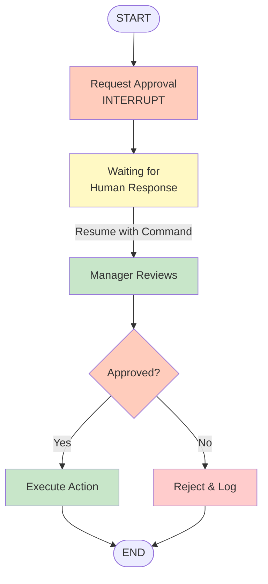
```mermaid
graph TD
    START([START]) --> Request["Request Approval<br/>INTERRUPT"]
    
    Request --> Wait["Waiting for<br/>Human Response"]
    
    Wait -->|Resume with Command| Manager["Manager Reviews"]
    
    Manager --> Decision{"Approved?"}
    
    Decision -->|Yes| Execute["Execute Action"]
    Decision -->|No| Reject["Reject & Log"]
    
    Execute --> END([END])
    Reject --> END
    
    style Request fill:#ffccbc
    style Wait fill:#fff9c4
    style Manager fill:#c8e6c9
    style Decision fill:#ffccbc
    style Execute fill:#c8e6c9
    style Reject fill:#ffcccc
```

## Multi-Stage Approval Process

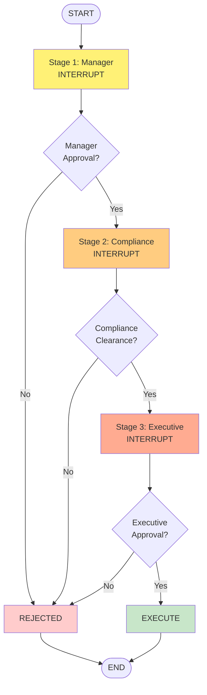
```mermaid
graph TD
    START([START]) --> Stage1["Stage 1: Manager<br/>INTERRUPT"]
    
    Stage1 --> Resume1{Manager<br/>Approval?}
    
    Resume1 -->|No| Reject["REJECTED"]
    Resume1 -->|Yes| Stage2["Stage 2: Compliance<br/>INTERRUPT"]
    
    Stage2 --> Resume2{Compliance<br/>Clearance?}
    
    Resume2 -->|No| Reject
    Resume2 -->|Yes| Stage3["Stage 3: Executive<br/>INTERRUPT"]
    
    Stage3 --> Resume3{Executive<br/>Approval?}
    
    Resume3 -->|No| Reject
    Resume3 -->|Yes| Execute["EXECUTE"]
    
    Reject --> END([END])
    Execute --> END
    
    style Stage1 fill:#fff176
    style Stage2 fill:#ffcc80
    style Stage3 fill:#ffab91
    style Execute fill:#c8e6c9
    style Reject fill:#ffcccc
```

## Hierarchical Multi-Agent System

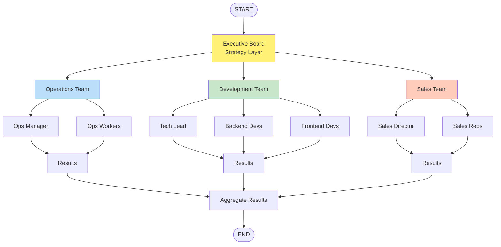
```mermaid
graph TD
    START([START]) --> CEO["Executive Board<br/>Strategy Layer"]
    
    CEO --> Ops["Operations Team"]
    CEO --> Dev["Development Team"]
    CEO --> Sales["Sales Team"]
    
    Ops --> OpsMgr["Ops Manager"]
    Ops --> OpsWorker["Ops Workers"]
    
    Dev --> DevLead["Tech Lead"]
    Dev --> Backend["Backend Devs"]
    Dev --> Frontend["Frontend Devs"]
    
    Sales --> SalesDir["Sales Director"]
    Sales --> SalesReps["Sales Reps"]
    
    OpsMgr --> Result1["Results"]
    OpsWorker --> Result1
    
    DevLead --> Result2["Results"]
    Backend --> Result2
    Frontend --> Result2
    
    SalesDir --> Result3["Results"]
    SalesReps --> Result3
    
    Result1 --> Aggregator["Aggregate Results"]
    Result2 --> Aggregator
    Result3 --> Aggregator
    
    Aggregator --> END([END])
    
    style CEO fill:#fff176
    style Ops fill:#bbdefb
    style Dev fill:#c8e6c9
    style Sales fill:#ffccbc
```

## Tree-of-Thoughts Exploration

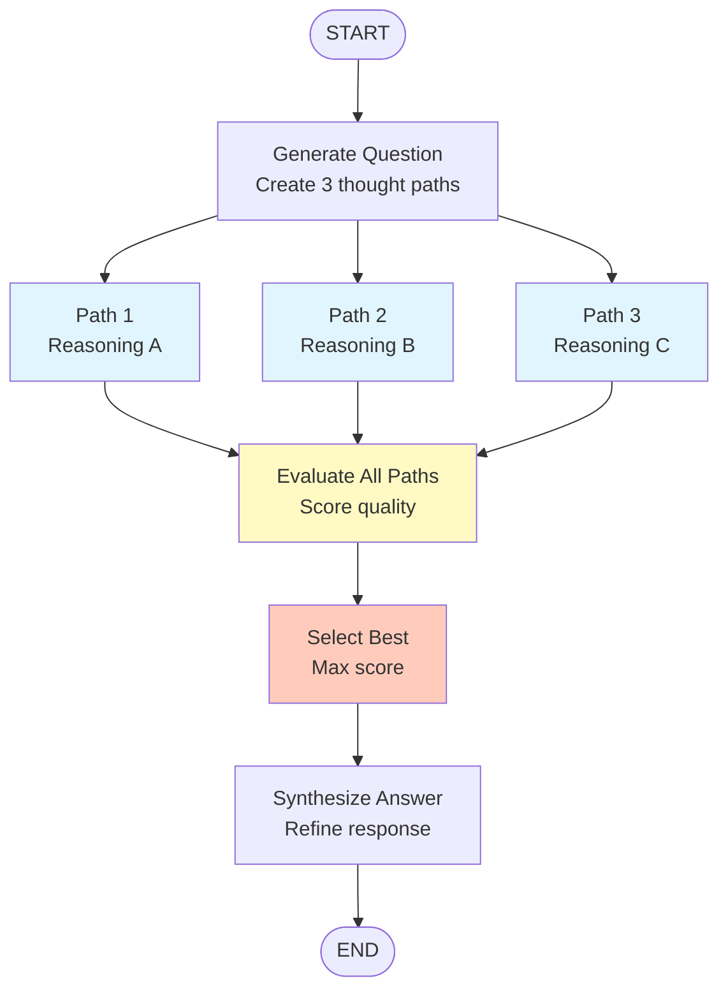
```mermaid
graph TD
    START([START]) --> Generate["Generate Question<br/>Create 3 thought paths"]
    
    Generate --> Path1["Path 1<br/>Reasoning A"]
    Generate --> Path2["Path 2<br/>Reasoning B"]
    Generate --> Path3["Path 3<br/>Reasoning C"]
    
    Path1 --> Evaluate["Evaluate All Paths<br/>Score quality"]
    Path2 --> Evaluate
    Path3 --> Evaluate
    
    Evaluate --> Select["Select Best<br/>Max score"]
    
    Select --> Synthesize["Synthesize Answer<br/>Refine response"]
    
    Synthesize --> END([END])
    
    style Path1 fill:#e1f5fe
    style Path2 fill:#e1f5fe
    style Path3 fill:#e1f5fe
    style Evaluate fill:#fff9c4
    style Select fill:#ffccbc
```

## Self-Reflection Loop

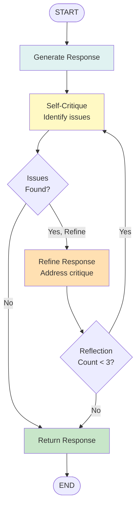
```mermaid
graph TD
    START([START]) --> Generate["Generate Response"]
    
    Generate --> Critique["Self-Critique<br/>Identify issues"]
    
    Critique --> Good{"Issues<br/>Found?"}
    
    Good -->|No| Return["Return Response"]
    Good -->|Yes, Refine| Refine["Refine Response<br/>Address critique"]
    
    Refine --> Counter{"Reflection<br/>Count < 3?"}
    
    Counter -->|Yes| Critique
    Counter -->|No| Return
    
    Return --> END([END])
    
    style Generate fill:#e0f2f1
    style Critique fill:#fff9c4
    style Refine fill:#ffe0b2
    style Return fill:#c8e6c9
```

## Handoff Pattern

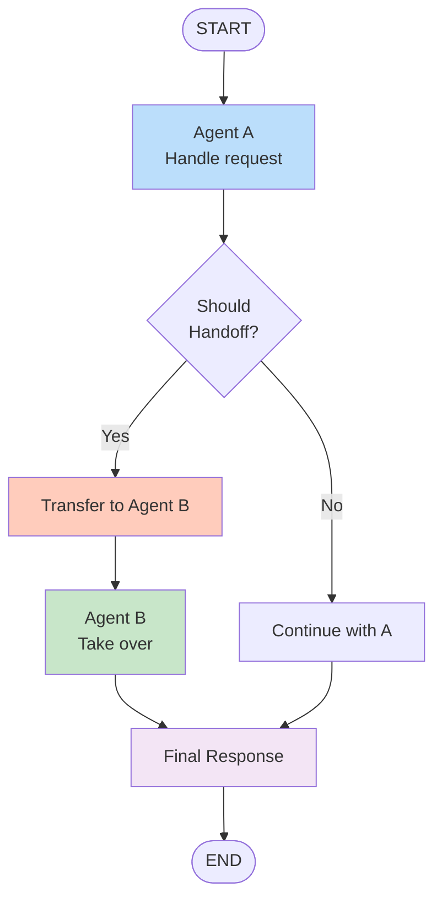
```mermaid
graph TD
    START([START]) --> AgentA["Agent A<br/>Handle request"]
    
    AgentA --> Check{"Should<br/>Handoff?"}
    
    Check -->|No| Response["Continue with A"]
    Check -->|Yes| Transfer["Transfer to Agent B"]
    
    Transfer --> AgentB["Agent B<br/>Take over"]
    
    AgentB --> Final["Final Response"]
    
    Response --> Final
    
    Final --> END([END])
    
    style AgentA fill:#bbdefb
    style AgentB fill:#c8e6c9
    style Transfer fill:#ffccbc
    style Final fill:#f3e5f5
```

## Streaming Data Flow

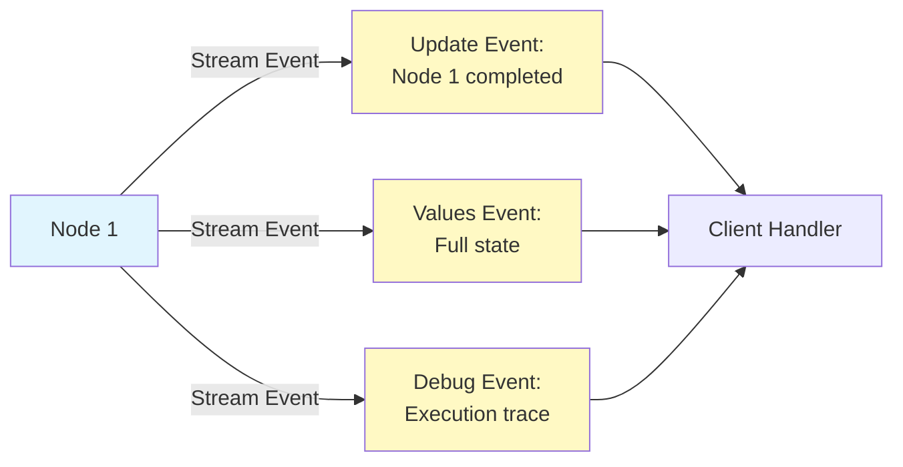
```mermaid
graph LR
    Node1["Node 1"] -->|Stream Event| Update1["Update Event:<br/>Node 1 completed"]
    Node1 -->|Stream Event| Values1["Values Event:<br/>Full state"]
    Node1 -->|Stream Event| Debug1["Debug Event:<br/>Execution trace"]
    
    Update1 --> Handler["Client Handler"]
    Values1 --> Handler
    Debug1 --> Handler
    
    style Node1 fill:#e1f5fe
    style Update1 fill:#fff9c4
    style Values1 fill:#fff9c4
    style Debug1 fill:#fff9c4
```

## Checkpoint & Persistence Architecture

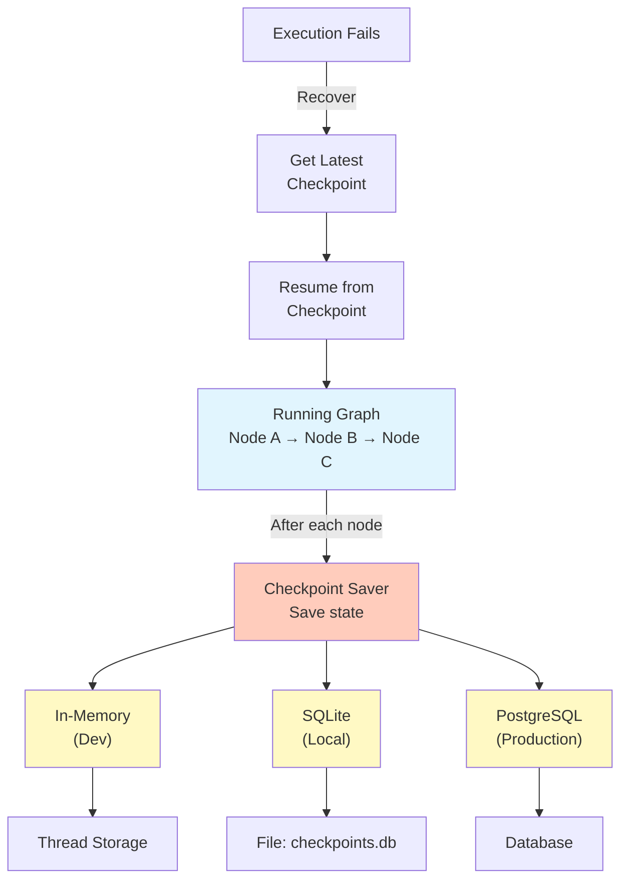
```mermaid
graph TD
    Graph["Running Graph<br/>Node A → Node B → Node C"]
    
    Graph -->|After each node| Checkpoint["Checkpoint Saver<br/>Save state"]
    
    Checkpoint --> Memory["In-Memory<br/>(Dev)"]
    Checkpoint --> SQLite["SQLite<br/>(Local)"]
    Checkpoint --> Postgres["PostgreSQL<br/>(Production)"]
    
    Memory --> Thread1["Thread Storage"]
    SQLite --> File["File: checkpoints.db"]
    Postgres --> DB["Database"]
    
    Failure["Execution Fails"] -->|Recover| Store["Get Latest<br/>Checkpoint"]
    Store --> Resume["Resume from<br/>Checkpoint"]
    Resume --> Graph
    
    style Graph fill:#e1f5fe
    style Checkpoint fill:#ffccbc
    style Memory fill:#fff9c4
    style SQLite fill:#fff9c4
    style Postgres fill:#fff9c4
```

## Long-term Memory Store Architecture

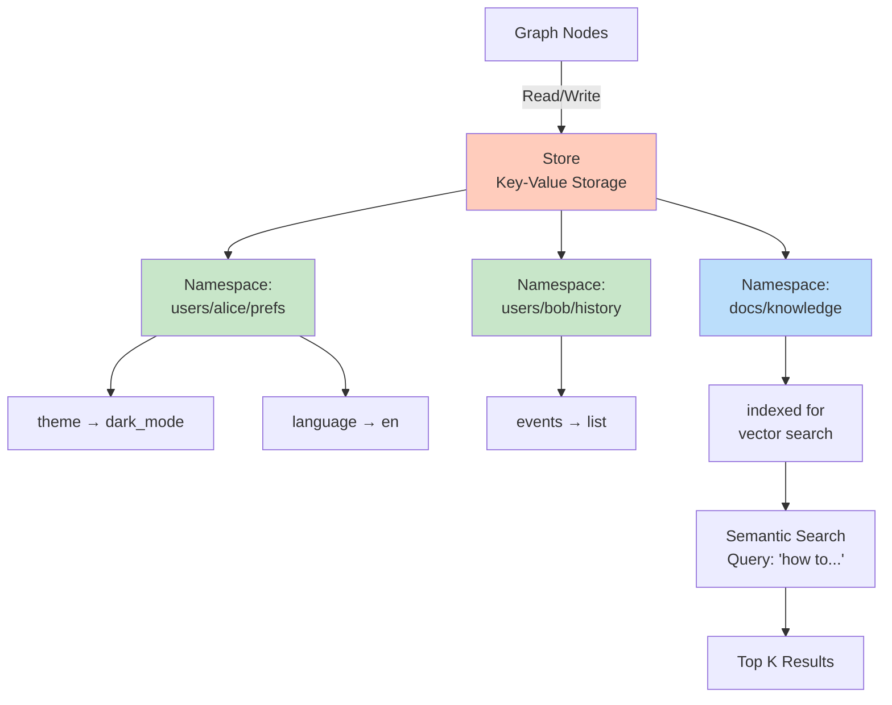
```mermaid
graph TD
    Nodes["Graph Nodes"] -->|Read/Write| Store["Store<br/>Key-Value Storage"]
    
    Store --> NS1["Namespace:<br/>users/alice/prefs"]
    Store --> NS2["Namespace:<br/>users/bob/history"]
    Store --> NS3["Namespace:<br/>docs/knowledge"]
    
    NS1 --> Key1["theme → dark_mode"]
    NS1 --> Key2["language → en"]
    
    NS2 --> Events["events → list"]
    
    NS3 --> Embed["indexed for<br/>vector search"]
    
    Embed --> Search["Semantic Search<br/>Query: 'how to...'"]
    Search --> Results["Top K Results"]
    
    style Store fill:#ffccbc
    style NS1 fill:#c8e6c9
    style NS2 fill:#c8e6c9
    style NS3 fill:#bbdefb
```

## Full Production Architecture

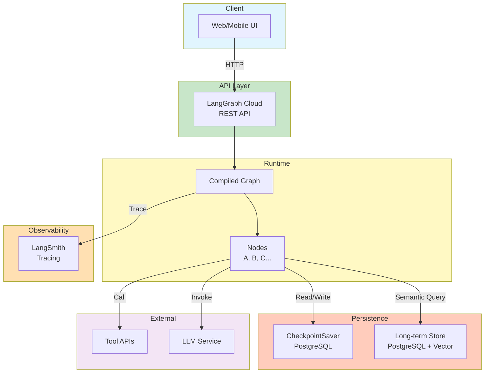
```mermaid
graph TB
    subgraph Client["Client"]
        UI["Web/Mobile UI"]
    end
    
    subgraph API["API Layer"]
        LGCloud["LangGraph Cloud<br/>REST API"]
    end
    
    subgraph Runtime["Runtime"]
        Graph["Compiled Graph"]
        Nodes["Nodes<br/>A, B, C..."]
    end
    
    subgraph Memory["Persistence"]
        CheckS["CheckpointSaver<br/>PostgreSQL"]
        Store["Long-term Store<br/>PostgreSQL + Vector"]
    end
    
    subgraph External["External"]
        Tools["Tool APIs"]
        LLM["LLM Service"]
    end
    
    subgraph Observe["Observability"]
        LangSmith["LangSmith<br/>Tracing"]
    end
    
    UI -->|HTTP| LGCloud
    LGCloud --> Graph
    Graph --> Nodes
    Nodes -->|Read/Write| CheckS
    Nodes -->|Semantic Query| Store
    Nodes -->|Call| Tools
    Nodes -->|Invoke| LLM
    Graph -->|Trace| LangSmith
    
    style Client fill:#e1f5fe
    style API fill:#c8e6c9
    style Runtime fill:#fff9c4
    style Memory fill:#ffccbc
    style External fill:#f3e5f5
    style Observe fill:#ffe0b2
```

## State Reducer Functions

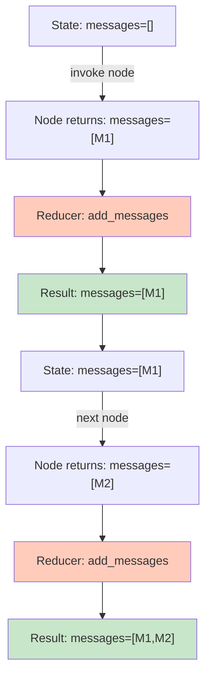
```mermaid
graph TD
    A["State: messages=[]"]
    B["Node returns: messages=[M1]"]
    C["Reducer: add_messages"]
    D["Result: messages=[M1]"]
    
    A -->|invoke node| B
    B --> C
    C --> D
    
    D --> A2["State: messages=[M1]"]
    B2["Node returns: messages=[M2]"]
    C2["Reducer: add_messages"]
    D2["Result: messages=[M1,M2]"]
    
    A2 -->|next node| B2
    B2 --> C2
    C2 --> D2
    
    style C fill:#ffccbc
    style C2 fill:#ffccbc
    style D fill:#c8e6c9
    style D2 fill:#c8e6c9
```

## Conditional Edge Resolution

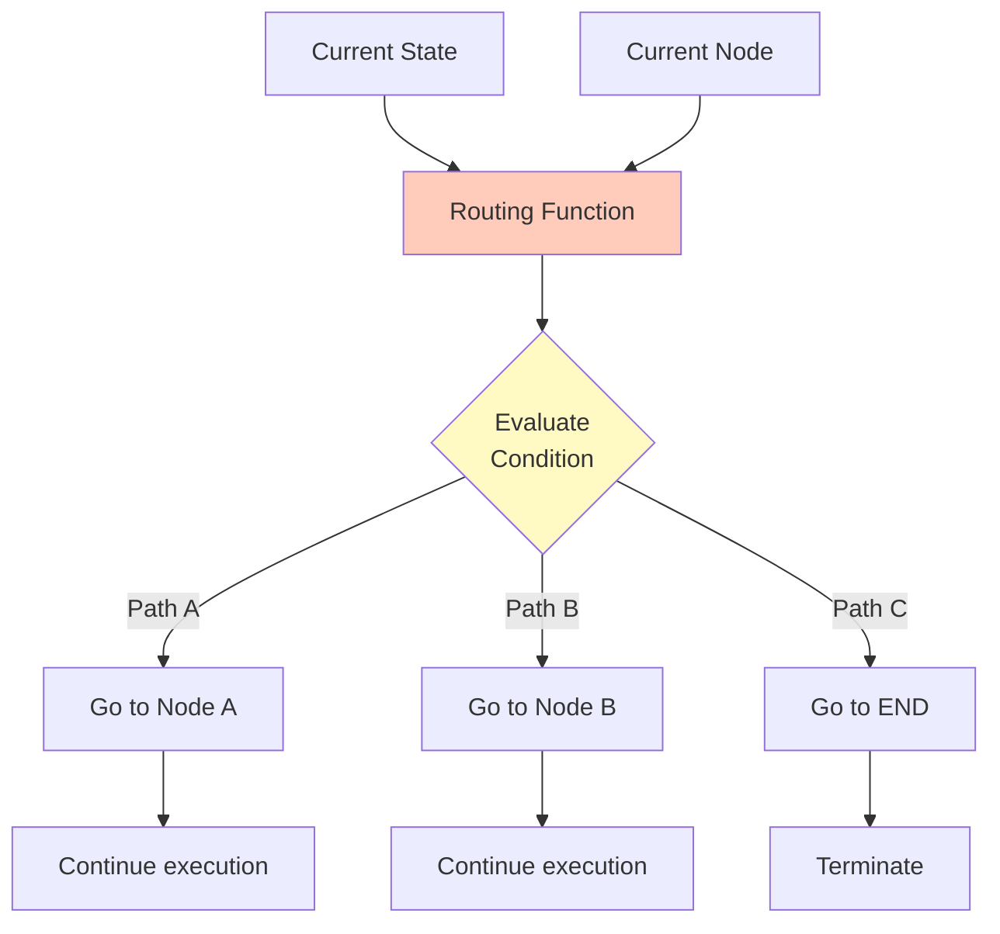
```mermaid
graph TD
    Node["Current Node"]
    Func["Routing Function"]
    State["Current State"]
    
    State --> Func
    Node --> Func
    
    Func --> Decision{"Evaluate<br/>Condition"}
    
    Decision -->|Path A| NodeA["Go to Node A"]
    Decision -->|Path B| NodeB["Go to Node B"]
    Decision -->|Path C| END_NODE["Go to END"]
    
    NodeA --> Continue1["Continue execution"]
    NodeB --> Continue2["Continue execution"]
    END_NODE --> Stop["Terminate"]
    
    style Func fill:#ffccbc
    style Decision fill:#fff9c4
```

---

## State Schema Patterns

### Pattern 1: Simple Reducer

```python
# Visual representation:
# Step 1: State = {count: 5}
# Step 2: Node returns {count: +3}
# Step 3: Reducer (add): Result = {count: 8}

class State(TypedDict):
    count: Annotated[int, add]
```

### Pattern 2: Message Accumulation

```python
# Visual representation:
# Initial: messages=[]
# Step 1: append [User: "Hello"]     → [User: "Hello"]
# Step 2: append [AI: "Hi there"]    → [User: "Hello", AI: "Hi there"]
# Step 3: append [User: "Thanks"]    → [User: "Hello", AI: "Hi there", User: "Thanks"]

class State(TypedDict):
    messages: Annotated[list, add_messages]
```

### Pattern 3: Dictionary Merge

```python
# Visual representation:
# Initial: updates={}
# Step 1: {node_a: result_a}          → {node_a: result_a}
# Step 2: {node_b: result_b}          → {node_a: result_a, node_b: result_b}
# Step 3: {node_c: result_c}          → {node_a: result_a, node_b: result_b, node_c: result_c}

class State(TypedDict):
    results: Annotated[dict, lambda x, y: {**x, **y}]
```

---

## Execution Timeline Example


```
Thread: "user-123"

Checkpoint 1 [ID: chk-001]
├─ Node: fetch_context
├─ Time: 10:00:00
├─ State: {user_id: "123", context: {...}}
└─ Status: Complete

Checkpoint 2 [ID: chk-002]
├─ Node: call_model
├─ Time: 10:00:02
├─ State: {messages: [User, AI], response: "..."}
└─ Status: Complete

Checkpoint 3 [ID: chk-003]
├─ Node: save_chat
├─ Time: 10:00:03
├─ State: {messages: [...], persisted: True}
└─ Status: Complete

[Can resume from any checkpoint for debugging]
```


---

## Error Handling Flow

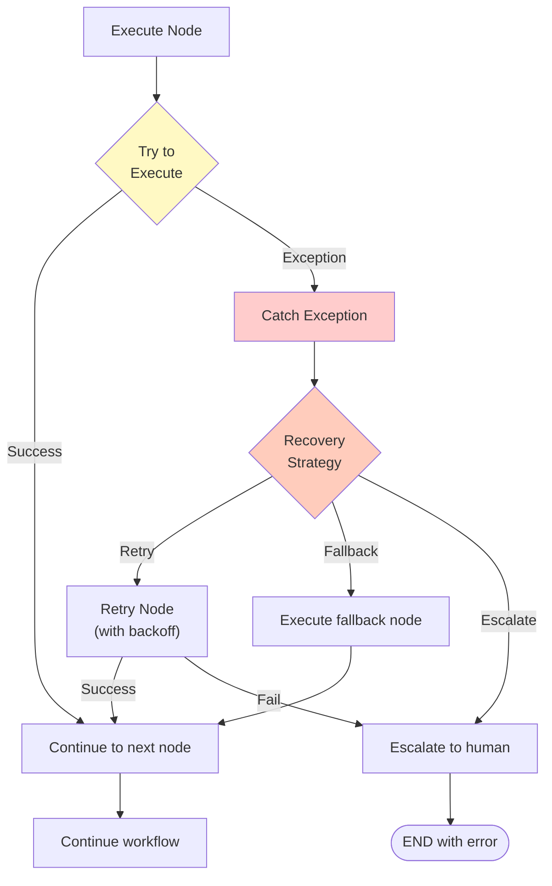
```mermaid
graph TD
    Execute["Execute Node"]
    
    Execute --> Try{"Try to<br/>Execute"}
    
    Try -->|Success| Next["Continue to next node"]
    Try -->|Exception| Catch["Catch Exception"]
    
    Catch --> Decide{"Recovery<br/>Strategy"}
    
    Decide -->|Retry| Retry["Retry Node<br/>(with backoff)"]
    Decide -->|Fallback| Fallback["Execute fallback node"]
    Decide -->|Escalate| Escalate["Escalate to human"]
    
    Retry -->|Success| Next
    Retry -->|Fail| Escalate
    
    Fallback --> Next
    Escalate --> END([END with error])
    Next --> Done["Continue workflow"]
    
    style Try fill:#fff9c4
    style Catch fill:#ffcccc
    style Decide fill:#ffccbc
```

---

## Performance Considerations

```
Graph Execution Performance:

Sequential Execution:
Task A (1s) → Task B (1s) → Task C (1s) = 3s total

Parallel Execution (Fan-out/Fan-in):
Task A (1s) ──┐
Task B (1s) ──┼──> Collect (0.1s) = 1.1s total
Task C (1s) ──┘

Streaming:
Receive data incrementally instead of waiting for all results
Real-time updates to client as processing happens

Caching:
First call: 1s
Cached calls: 0.01s
```

---

## Configuration Hierarchy

```mermaid
graph TD
    Default["LangGraph Defaults"]
    ProjectConfig["Project Config<br/>langgraph.json"]
    RuntimeConfig["Runtime Config<br/>env vars"]
    RequestConfig["Request Config<br/>graph.invoke(config=...)"]
    
    Default --> ProjectConfig
    ProjectConfig --> RuntimeConfig
    RuntimeConfig --> RequestConfig
    
    RequestConfig --> Final["Final Configuration<br/>Used by Graph"]
    
    style RequestConfig fill:#fff176
    style Final fill:#c8e6c9
```

## Debugging Workflow

```mermaid
graph TD
    Issue["Issue Detected"]
    
    Issue --> Symptoms{"Symptoms?"}
    
    Symptoms -->|State not persisting| Check1["Check thread_id<br/>Check checkpointer"]
    Symptoms -->|Tools not calling| Check2["Check bind_tools()<br/>Check tool_calls exist"]
    Symptoms -->|Loop forever| Check3["Check exit condition<br/>Check MAX_ITERATIONS"]
    Symptoms -->|Interrupt fails| Check4["Check checkpointer exists<br/>Check Command.resume"]
    
    Check1 --> Stream["Use stream_mode='debug'"]
    Check2 --> Stream
    Check3 --> Stream
    Check4 --> Stream
    
    Stream --> Inspect["Inspect checkpoint history<br/>graph.get_state_history()"]
    
    Inspect --> TimeTravelDebug["Time-travel to old checkpoint<br/>Resume from there"]
    
    TimeTravelDebug --> Verify["Verify fix works"]
    
    style Issue fill:#ffcccc
    style Stream fill:#fff9c4
    style Verify fill:#c8e6c9
```