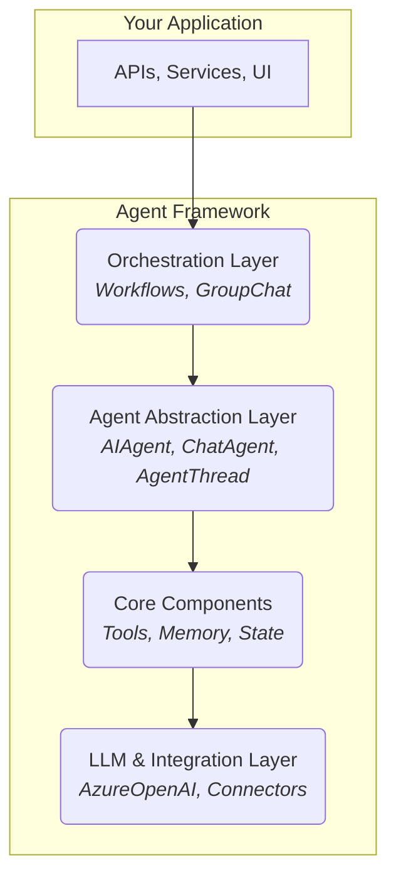
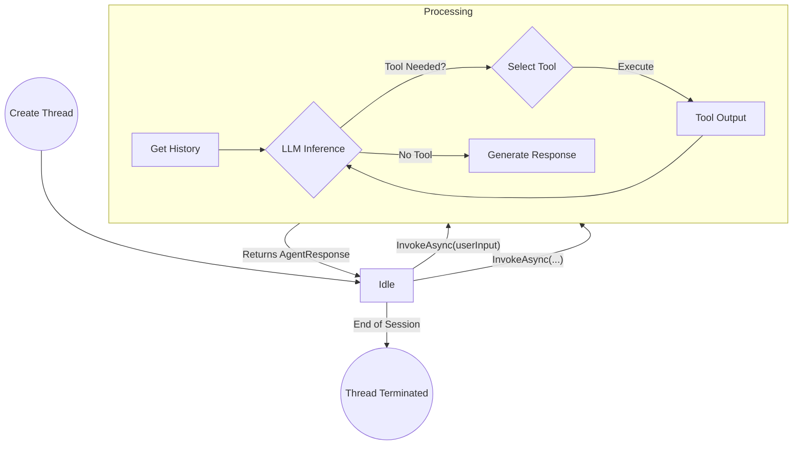
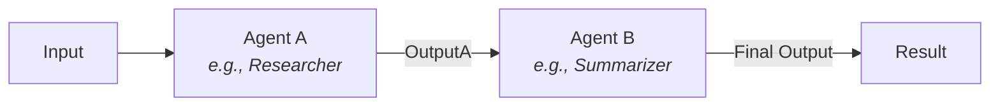
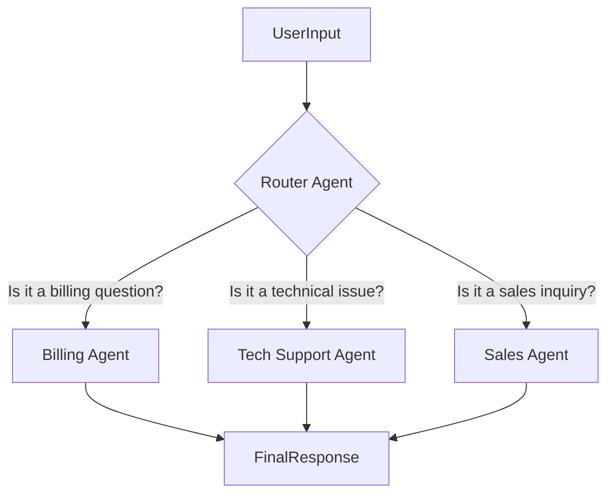
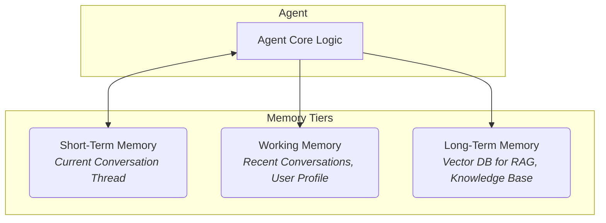
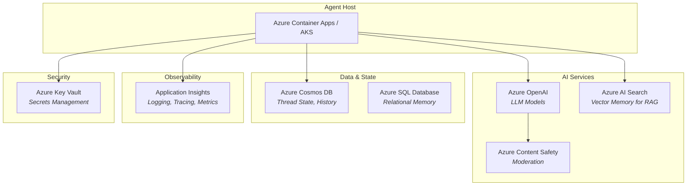
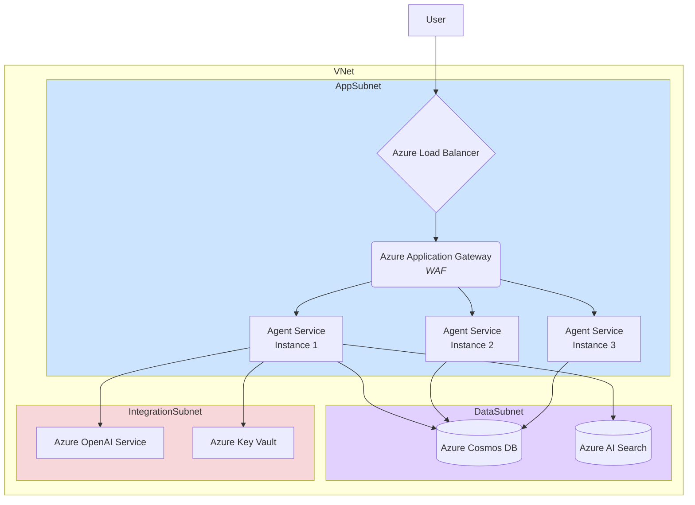
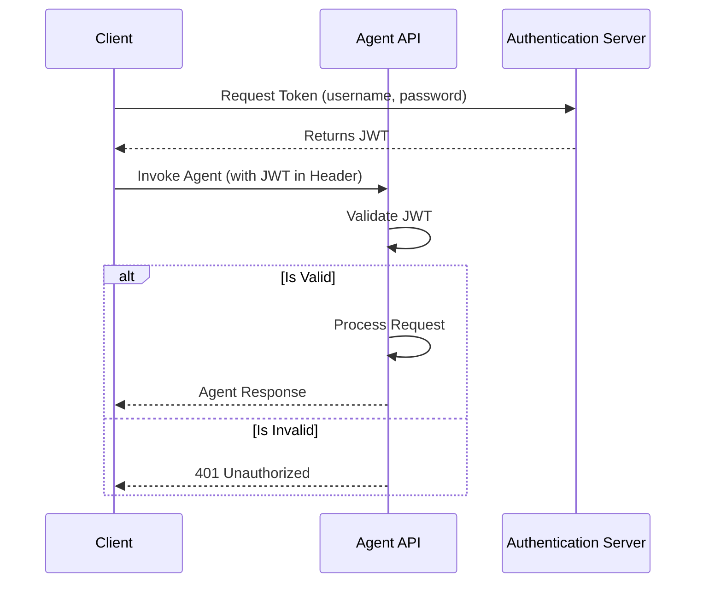
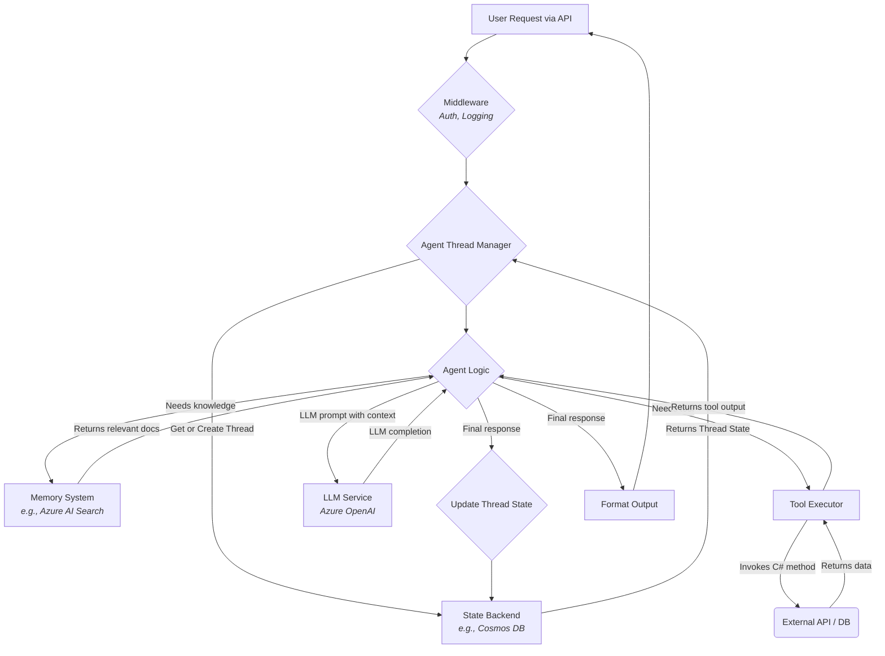

# Microsoft Agent Framework .NET - Architecture & Workflow Diagrams

This document provides visual representations of the key architectural concepts, data flows, and interaction patterns within the Microsoft Agent Framework for .NET.

---

## 1. System Architecture

### High-Level Framework Design

This diagram shows the layered architecture of the framework, from the core components up to the application layer.



---

## 2. Agent Lifecycle

### State Machine for a `ChatAgent`

This diagram illustrates the lifecycle of a stateful `ChatAgent` as it processes messages within a thread.



---

## 3. Multi-Agent Orchestration

### Sequential Workflow

Agent A's output becomes the input for Agent B.



### Router (Broadcast) Pattern

A router agent delegates a task to the most appropriate specialist agent.



---

## 4. Tool Integration

### Tool Execution Pipeline

This shows how an agent selects and executes a tool.

```mermaid
graph TD
    Agent[Agent Logic] -- "User asks a question" --> LLM{LLM Decides}
    LLM -- "Tool 'GetCurrentWeather' should be called" --> ToolSelection
    
    subgraph Tool Execution
        ToolSelection[Select 'GetCurrentWeather' Tool]
        ToolSelection -- "Invoke with params: { city: 'Seattle' }" --> CSharpTool(C# Method<br/><i>GetCurrentWeather("Seattle")</i>)
        CSharpTool -- "Returns 'Rainy, 55°F'" --> ToolResult
    end

    ToolResult -- "Provide tool output back to LLM" --> LLM
    LLM -- "Formulate final answer" --> AgentResponse[Agent Response to User]
```

---

## 5. Memory Systems

### Multi-Tier Memory Architecture

Agents can access different layers of memory for context.



---

## 6. Azure Integration

### Azure Service Ecosystem

This diagram shows how the Agent Framework integrates with key Azure services.



---

## 7. Deployment Architecture

### Production Topology on Azure

A typical high-availability deployment on Azure.



---

## 8. Security & Authentication Flow

### JWT-Based Authentication Flow

This shows a typical flow for securing an agent API.



---

## 9. Data Flow

### Complete Request-Response Cycle

This diagram traces a single user request through the entire system.

