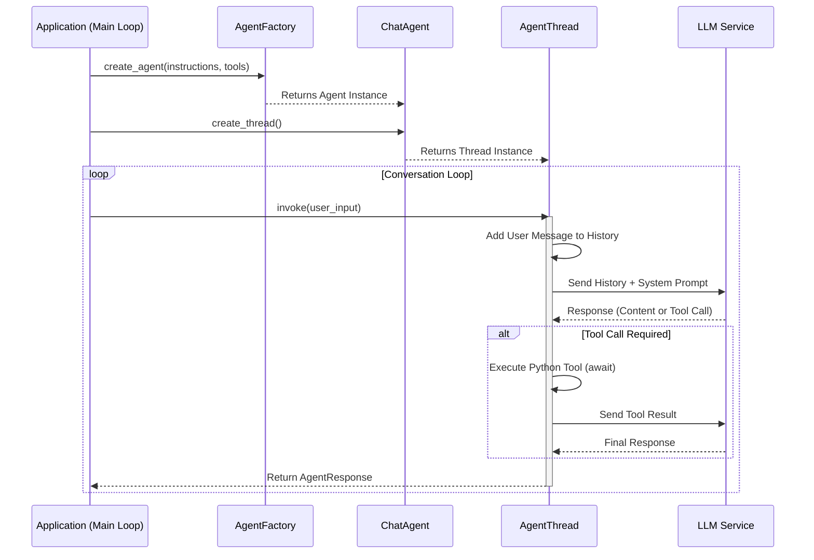
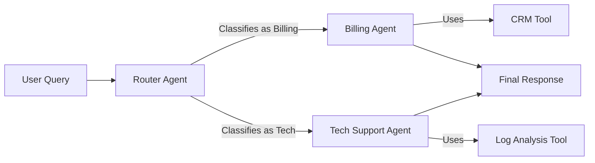
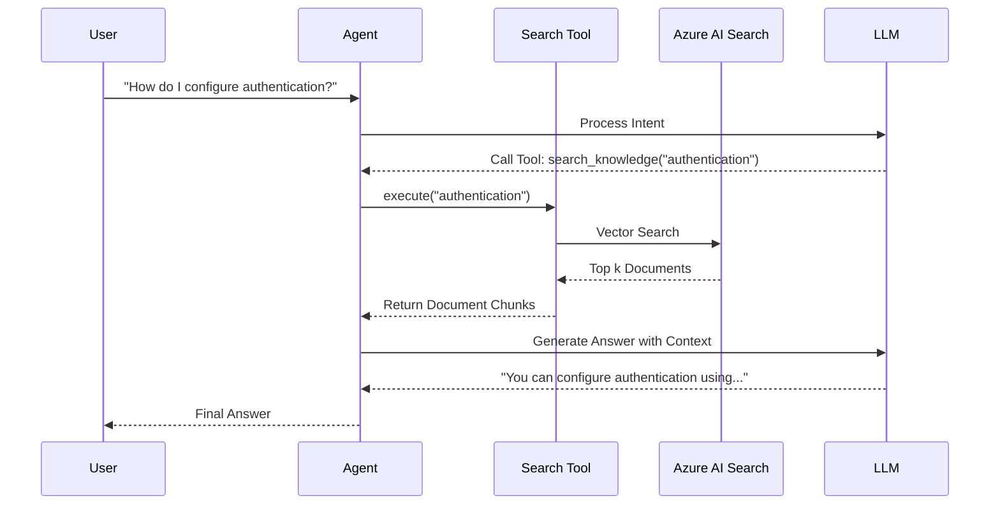

# Microsoft Agent Framework Python - Architecture Diagrams

This document provides visual references for the architecture, data flow, and deployment topology of Python-based agent systems.

**Target Platform:** Python 3.10+

---

## 1. System Architecture

### High-Level Layered Design

```mermaid
graph TD
    User[User / Client App] --> API[FastAPI / Flask Interface]
    
    subgraph "Agent Framework (Python)"
        API --> Orchestrator[Orchestrator / Workflow]
        Orchestrator --> AgentA[ChatAgent A]
        Orchestrator --> AgentB[ChatAgent B]
        
        AgentA --> Memory[Memory Store]
        AgentA --> Tools[Tools / Plugins]
        
        Tools --> PythonFunc[Python Functions]
        Tools --> AzureAI[Azure AI Services]
    end
    
    AgentA --> LLM[LLM Service (OpenAI)]
    Memory --> VectorDB[Vector Database]
```

---

## 2. Agent Lifecycle (AsyncIO)

The lifecycle of a Python agent within an `asyncio` event loop.



---

## 3. Multi-Agent Orchestration (Router Pattern)

A common pattern where a router agent dispatches tasks to specialized agents.



---

## 4. Deployment Architecture (Azure Container Apps)

Recommended production topology for Python agents.

```mermaid
graph TD
    Internet((Internet)) --> FrontDoor[Azure Front Door]
    FrontDoor --> ACAEnv[Azure Container Apps Environment]
    
    subgraph "ACA Environment (VNet)"
        Ingress[Ingress Controller] --> Service[Python Agent Service (Gunicorn)]
        
        Service -->|Scale Out| Replica1[Replica 1]
        Service -->|Scale Out| Replica2[Replica 2]
        Service -->|Scale Out| ReplicaN[Replica N]
    end
    
    Replica1 --> KeyVault[Azure Key Vault]
    Replica1 --> OpenAI[Azure OpenAI]
    Replica1 --> Cosmos[Cosmos DB (Memory)]
    
    KEDA[KEDA Scaler] -->|Monitors| Service
    KEDA -.->|Metrics| AzureMonitor[Azure Monitor]
```

---

## 5. RAG Data Flow

Retrieval-Augmented Generation flow using Python and Azure AI Search.


